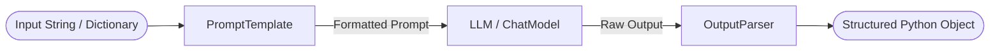

# LangChain Foundations

This folder contains the core foundational concepts of LangChain, exploring the fundamental building blocks required to build LLM applications.

## Key Concepts and Available Options

### 1. LLMs vs. Chat Models
When working with Language Models, LangChain provides two primary interfaces.
*   **Options:**
    *   **`LLM` (Standard Language Models):** Takes a string as input and returns a string. Older paradigm (e.g., standard text completion).
    *   **`ChatModel`:** Takes a list of Messages (System, Human, AI) as input and returns an AI Message. This is the modern standard for interacting with models like GPT-4 or Claude 3.
*   **📦 Out of the Box:** LangChain provides built-in wrapper classes for almost all major providers (`ChatOpenAI`, `ChatAnthropic`, `ChatGoogleGenerativeAI`, etc.).
*   **🛠️ Manual Implementation:** If you are using a proprietary model or an API not supported natively, you will need to create a Custom LLM class by inheriting from `BaseChatModel`.

### 2. Prompt Templates
Prompts are the instructions you give to the LLM. Dynamic prompts require templates.
*   **Options:**
    *   **`PromptTemplate`:** Used for standard LLMs. A simple string with variables (e.g., `"Tell me a joke about {topic}"`).
    *   **`ChatPromptTemplate`:** Used for Chat Models. Contains an array of messages, defining clear roles (System prompt for instructions, Human prompt for user input).
    *   **`FewShotPromptTemplate`:** Used to provide examples to the model before asking the final question.
*   **📦 Out of the Box:** Built-in template classes allow for partial formatting, dynamic message placeholders (e.g., injecting chat history), and pipeline integration.
*   **🛠️ Manual Implementation:** Creating complex prompt routers or conditional prompt selection logic based on custom rules (though LCEL provides `RunnableBranch` for some of this).

### 3. Output Parsers
LLMs output raw text. Parsers force the LLM to output specific formats and parse them into Python objects.
*   **Options:**
    *   **`PydanticOutputParser`:** Extracts data into a structured Pydantic object (excellent for robust, typed data extraction).
    *   **`JsonOutputParser`:** Extracts data into a standard Python dictionary.
    *   **`CommaSeparatedListOutputParser`:** Parses a comma-separated string into a Python list.
    *   **`StrOutputParser`:** The simplest parser, extracting just the string content from an `AIMessage` object.
*   **📦 Out of the Box:** LangChain automatically injects formatting instructions into your prompt (via `parser.get_format_instructions()`) and parses the resulting string for you.
*   **🛠️ Manual Implementation:** If the LLM returns an obscure format (like custom XML or Markdown tables), you will need to write custom parsing logic using regex or string manipulation.

---

## Files in this Module

- **`core_concepts.py`**: Demonstrates the basics of LCEL (LangChain Expression Language), including basic chains, batch execution, streaming, and schema inspection.
- **`working_with_llms.py`**: Shows how to initialize and compare different LLMs (like OpenAI and Anthropic) and how to handle chat messages.
- **`prompt_messages.py`**: Covers `ChatPromptTemplate`, message types (Human, AI, System), and few-shot prompting.
- **`prompt_templates_all.py`**: Examples of different prompt templates.
- **`output_parsers_demo.py` & `output_parsers_final.py`**: Demonstrates how to parse LLM string outputs into structured data.
