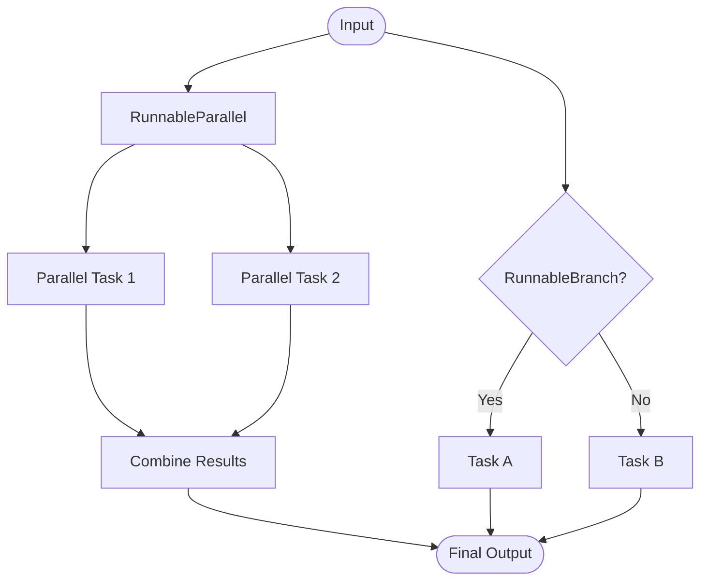

# Chain Patterns

This folder contains examples of different chain patterns in LangChain, which form the backbone of multi-step LLM operations.

## Key Concepts and Available Options

### 1. Chain Paradigms
Chains are sequences of calls to LLMs, tools, or data preprocessing steps.
*   **Options:**
    *   **LCEL (LangChain Expression Language):** The modern, declarative way to build chains using the pipe operator (`|`). For example: `prompt | llm | output_parser`.
    *   **Legacy Chains (`LLMChain`, `SequentialChain`, etc.):** The older object-oriented approach. (Mostly deprecated in favor of LCEL).
*   **📦 Out of the Box:** LCEL provides massive built-in benefits including out-of-the-box support for streaming (`.stream()`), asynchronous execution (`.ainvoke()`), and batch processing (`.batch()`).
*   **🛠️ Manual Implementation:** When your chain requires complex control flow (like `while` loops) that don't fit well into a static LCEL pipeline, you must implement manual Python functions and use the `@chain` decorator, or transition to a Graph framework (like LangGraph).

### 2. LCEL Primitives (Runnables)
LCEL provides standard primitives to manipulate data as it flows through the chain.
*   **Options:**
    *   **`RunnableSequence`:** The standard pipeline (created using `|`). Passes the output of one step as the input to the next.
    *   **`RunnableParallel` / `RunnableMap`:** Executes multiple steps concurrently and returns a dictionary with the results. Great for executing independent tasks simultaneously.
    *   **`RunnablePassthrough`:** Passes the input data unchanged to the next step. Often used alongside `RunnableParallel` to maintain original input alongside new data.
    *   **`RunnableBranch`:** Adds `if/else` logic to route inputs to different sub-chains based on a condition (e.g., routing a user's question to a Math chain vs. a History chain).
*   **📦 Out of the Box:** These primitives are fully functional from the LangChain library and handle all async/sync routing internally.
*   **🛠️ Manual Implementation:** Custom arbitrary logic (like formatting strings specifically, or calling external non-LangChain APIs) must be manually wrapped in a `RunnableLambda` (or simply a regular Python function integrated into the LCEL chain).

---

## Files in this Module

- **`chains_v1.py`**: Demonstrates LCEL patterns including basic chains, parallel chains, passthrough chains, branching based on intent, and debugging techniques.
