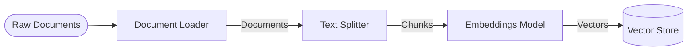

# Document Loading & Embeddings

This folder covers the data ingestion components of LangChain, converting raw external data into searchable vector embeddings.

## Key Concepts and Available Options

### 1. Document Loaders
Loaders extract text and metadata from various sources into LangChain `Document` objects.
*   **Options:**
    *   **Text/File Loaders:** `TextLoader`, `PyPDFLoader`, `CSVLoader`, etc.
    *   **Web Loaders:** `WebBaseLoader` (uses BeautifulSoup), `PlaywrightURLLoader` (for JS-rendered pages).
    *   **Application Loaders:** Integrations for Notion, Slack, Google Drive, etc.
*   **📦 Out of the Box:** LangChain has hundreds of built-in integrations for almost every major file format and SaaS tool. They automatically extract the text content and populate basic metadata (like `source`).
*   **🛠️ Manual Implementation:** If you have an obscure internal API or a very specific legacy file format, you must write a custom loader class by inheriting from `BaseLoader` and implementing the `lazy_load` method.

### 2. Text Splitters
LLMs have context windows. Large documents must be split into smaller "chunks" before embedding.
*   **Options:**
    *   **`CharacterTextSplitter`:** Splits by a single specific character (like a newline `\n`). Simple but often breaks sentences.
    *   **`RecursiveCharacterTextSplitter`:** The recommended default. Tries to split by paragraphs (`\n\n`), then sentences (`\n`), then words (` `), then characters, keeping chunks semantically coherent.
    *   **`MarkdownHeaderTextSplitter`:** Splits documents based on Markdown headers (e.g., `#`, `##`), keeping chunks grouped by document structure.
*   **📦 Out of the Box:** Built-in splitters handle overlapping (to prevent cutting concepts in half) and metadata propagation automatically.
*   **🛠️ Manual Implementation:** Advanced Semantic Chunking (grouping chunks by mathematical similarity rather than token count) often requires manual implementation or using experimental LangChain features.

### 3. Embeddings Models
Embedding models convert chunks of text into numerical vectors (arrays of floats).
*   **Options:**
    *   **Cloud API Models:** `OpenAIEmbeddings`, `CohereEmbeddings` (High quality, requires API key, costs money).
    *   **Local Models:** `HuggingFaceEmbeddings`, `OllamaEmbeddings` (Free, runs on your machine, keeps data private).
*   **📦 Out of the Box:** LangChain standardizes all models under the `Embeddings` interface, meaning you can swap an OpenAI model for an Ollama model with zero code changes in your pipeline.

### 4. Vector Stores
Databases optimized to store and query high-dimensional vectors efficiently via similarity search.
*   **Options:**
    *   **In-Memory/Local:** `Chroma`, `FAISS`. Great for prototyping, local apps, or ephemeral usage.
    *   **Cloud/Production:** `Pinecone`, `Weaviate`, `Qdrant`, `Milvus`, `pgvector` (PostgreSQL).
*   **📦 Out of the Box:** Built-in functions like `from_documents()` immediately embed your chunks and save them to the database. All stores support `similarity_search(query)`.
*   **🛠️ Manual Implementation:** Advanced database configuration (like hybrid search—combining keyword search with vector search—or fine-tuning database indexes) requires directly configuring the underlying database platform, bypassing LangChain abstractions.

---

## Files in this Module

- **`document_loaders.py`**: Shows how to load documents from various sources like text files, PDFs, and web pages.
- **`text_splitters.py`**: Demonstrates strategies for chunking text for Vector databases (recursive character, markdown header, code splitters).
- **`embeddings.py` & `embeddings_deep.py`**: Examples of using different embedding models (HuggingFace, Ollama, OpenAI) to convert text into vector representations.
- **`vector_stores.py`**: Shows how to store embeddings in a vector database (Chroma) and how to use it as a retriever for similarity search.
