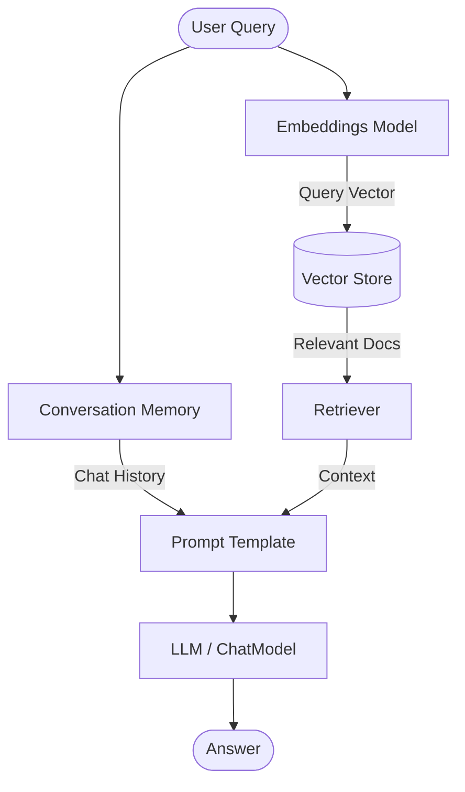

# RAG Architecture (Retrieval-Augmented Generation)

This folder brings everything together into a complete RAG system: loading data, creating embeddings, retrieving relevant chunks, and feeding them to an LLM to answer user questions contextually.

## Key Concepts and Available Options

### 1. Retrievers
A Retriever is an interface that takes a string query and returns a list of relevant `Document` objects. It does not dictate *how* they are stored, only how they are fetched.
*   **Options:**
    *   **`VectorStoreRetriever`:** The most basic and common. Simply takes a Vector Store and performs similarity search.
    *   **`MultiQueryRetriever`:** Uses an LLM to generate multiple variations of the user's question, searches for all variations, and takes the union of the results. Great for overcoming poorly phrased user questions.
    *   **`ContextualCompressionRetriever`:** Passes retrieved documents through a secondary process (an LLM or a reranker) to extract *only* the relevant sentences and discard the fluff before sending them to the final answer generation chain.
    *   **`ParentDocumentRetriever`:** Embeds and searches small chunks of text, but returns the *larger parent document* those chunks belong to. Great for balancing search accuracy with providing maximum context to the LLM.
*   **📦 Out of the Box:** LangChain provides built-in classes for all of these advanced retrieval strategies, automatically handling the prompt generation and sub-chaining required for things like Multi-Query.
*   **🛠️ Manual Implementation:** Merging results from multiple completely different sources (e.g., querying a SQL database AND a Vector Database and merging the results) usually requires building a custom Retriever class or routing logic.

### 2. Conversation Memory
Stateless LLMs don't remember previous questions. Memory injects chat history into the prompt.
*   **Options:**
    *   **`ConversationBufferMemory`:** The simplest. Stores the raw chat history and injects the whole thing into every prompt. Risks exceeding the LLM context window quickly.
    *   **`ConversationWindowMemory`:** Only keeps the last *N* exchanges (e.g., the last 5 messages). Drops older context but saves tokens.
    *   **`ConversationSummaryMemory`:** Uses an LLM running in the background to constantly summarize the chat history as it grows. Extremely token-efficient but slower and more expensive per turn.
    *   **`RunnableWithMessageHistory` (LCEL):** The modern, recommended way to handle memory in LCEL chains. Automatically fetches session history by an ID and appends it to the prompts.
*   **📦 Out of the Box:** All memory types work out-of-the-box using in-memory variables (RAM). Perfect for single-user scripts or prototyping.
*   **🛠️ Manual Implementation:** For a production web application with multiple users, you must manually implement persistent database-backed history (e.g., using `RedisChatMessageHistory` or `PostgresChatMessageHistory`) to load and save states per user session ID.

### 3. RAG Pipelines (Agents vs. Chains)
*   **Options:**
    *   **Static RAG Chains:** A hardcoded pipeline (Retrieve -> Prompt -> Generate). Always executes exactly the same way. Best for simple Q&A.
    *   **Agents:** An LLM equipped with tools (e.g., a "Search Vector DB" tool and a "Search Web" tool). The LLM autonomously decides *if* it needs to search the DB, *which* query to use, and *when* it has enough info to answer.
*   **📦 Out of the Box:** LangChain provides `create_retrieval_chain` for static RAG, and `create_tool_calling_agent` for basic Agentic workflows.
*   **🛠️ Manual Implementation:** Highly complex, multi-actor, or looping Agent workflows with specific constraints are best implemented manually using LangGraph rather than standard LangChain primitives.

---

## Files in this Module

- **`rag_pipeline.py`**: A standard RAG pipeline demonstrating loading data, chunking, embedding, retrieving, and answering.
- **`advanced_rag.py`**: Demonstrates advanced retrieval techniques like Multi-Query retrieval and Contextual Compression.
- **`conversation_memory.py`**: Shows how to add state and chat history to your chains.
- **`research_assistant.py`**: Example of pulling together tools and chains into a cohesive assistant application.
