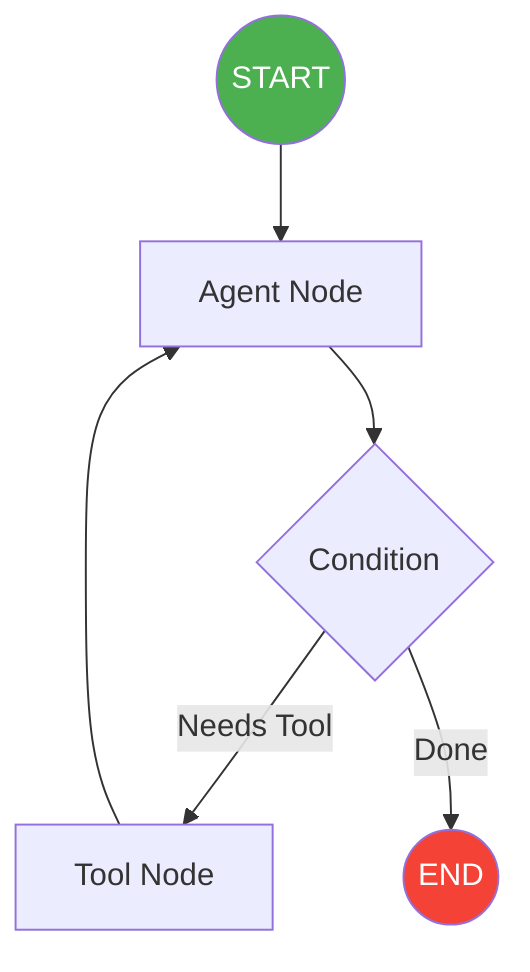

# LangGraph: Agents & Workflows

This folder contains the core concepts and advanced patterns of LangGraph, a library for building stateful, multi-actor applications with LLMs.

## Key Concepts and Architecture

Unlike standard LCEL chains which are direct pipelines (DAGs - Directed Acyclic Graphs), LangGraph allows for **cycles**. This means you can create self-correcting agents, loops, and complex state machines.

### 1. State
State is the shared memory that gets passed between all nodes in the graph.
*   **TypedDict:** We define the shape of our state (e.g., `messages`, `context`).
*   **Reducers:** LangGraph lets you define how state updates are handled (e.g., overriding a string vs. appending to a list of messages using `operator.add` or `add_messages`).

### 2. Nodes
Nodes are standard Python functions. They take the current `State` as input, do some work (like calling an LLM), and return a dictionary containing the updates to the state.

### 3. Edges & Conditional Edges
*   **Normal Edges:** Always go from Node A to Node B.
*   **Conditional Edges:** Run a routing function to decide where to go next. This is what gives Agents their autonomy (e.g., "If the LLM asked to use a tool, go to the Tool Node, otherwise go to END").

### 4. Checkpointing (Memory)
Checkpointers save the state at every step. This allows for:
*   **Long-term memory:** Resuming a conversation from days ago.
*   **Human-in-the-loop:** Pausing the graph to ask a human for approval before proceeding.
*   **Time Travel:** Rewinding to a previous state and branching off in a new direction.

---

## Learning Path

We have structured the files in numerical order for easy learning:

1. **`01_first_graph.py`**: A simple introduction to defining State, Nodes, and compiling a Graph.
2. **`02_langgraph_core.py`**: Deep dive into State management, Reducers, and the standard Message State pattern.
3. **`03_conditional_edges.py`**: How to implement routing and decision-making logic.
4. **`04_cycles_loops.py`**: Implementing self-correcting agents and iterative refinement loops.
5. **`05_checkpointing.py`**: Adding persistence using `MemorySaver` and `SqliteSaver`, plus inspecting state history.
6. **`06_human_in_loop.py`**: How to interrupt execution, inspect state, and allow a human to approve or modify the workflow before resuming.
7. **`07_agent_handoffs.py`**: Advanced pattern showing a Multi-Agent system where specialized agents hand off control and context to each other.
