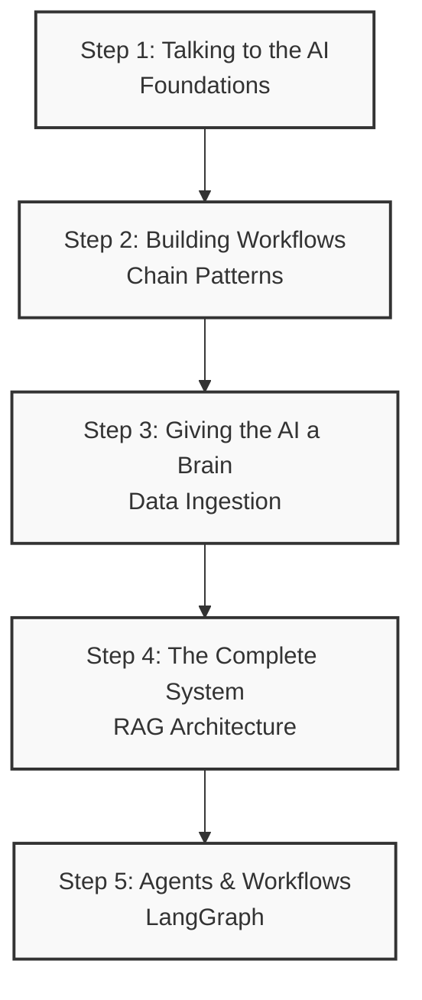

# LangChain Developer Course: The Big Picture

Welcome to the LangChain educational project! This repository is structured to take you from the fundamental building blocks of LLMs all the way to a production-ready Retrieval-Augmented Generation (RAG) system. 

Instead of getting lost in individual functions, it's crucial to understand how these modules connect to form the "Big Picture" of modern AI applications.

---

## 🗺️ The Course Architecture

The course is divided into four main chronological modules. Each module solves a specific problem and feeds into the next.



### Step 1: Talking to the AI
👉 **[`03_langchain_foundations/`](./03_langchain_foundations/)**
Before you can build complex systems, you need to know how to communicate with the AI.
*   **The Problem:** LLMs just take strings and return strings. We need a structured way to give them instructions, inject variables, and format their unpredictable text output into clean code (like JSON or Python objects).
*   **The Tools:** `ChatModels`, `PromptTemplates`, `OutputParsers`.
*   *See the module's README for the specific configurations.*

### Step 2: Building Workflows
👉 **[`04_chain_patterns/`](./04_chain_patterns/)**
Once you can talk to the AI, you need to string multiple operations together.
*   **The Problem:** Real applications aren't just one prompt. You might need to format a prompt, send it to the LLM, parse the output, and then use that output to trigger *another* LLM call.
*   **The Tools:** LCEL (LangChain Expression Language), `RunnableSequence` (piping with `|`), `RunnableParallel`.
*   *See the module's README for how to route and parallelize tasks.*

### Step 3: Giving the AI a Brain (Data Ingestion)
👉 **[`05_document_loading_and_embeddings/`](./05_document_loading_and_embeddings/)**
LLMs only know what they were trained on. To answer questions about *your* specific data (like internal PDFs or codebases), you have to convert your data into a format the AI can search.
*   **The Problem:** How do we read a 100-page PDF, shrink it down, and store it so the AI can find exactly the right paragraph later?
*   **The Tools:** `DocumentLoaders` (to read files), `TextSplitters` (to chop them into chunks), `Embeddings` (to convert text to math), and `VectorStores` (to save the math).
*   *See the module's README for the different database and splitting options.*

### Step 4: The Complete System (RAG)
👉 **[`06_rag_architecture/`](./06_rag_architecture/)**
The final step. We connect our workflow (Step 2) to our database (Step 3) to answer user questions using our custom data.
*   **The Problem:** When a user asks a question, we need to search our Vector Database for the answer, inject that answer into a Prompt Template, and have the LLM read it to reply to the user—while also remembering the previous chat history!
*   **The Tools:** `Retrievers` (advanced search logic), `Memory` (chat history), and `RAG Chains`.
*   *See the module's README for how to configure memory and advanced retrieval strategies.*

### Step 5: Agents & Workflows (LangGraph)
👉 **[`07_langgraph/`](./07_langgraph/)**
Moving beyond static DAGs into stateful, multi-actor LLM applications.
*   **The Problem:** Traditional chains are linear and rigid. How do we build systems that can self-correct, loop, pause for human approval, or have multiple specialized AI agents talk to each other?
*   **The Tools:** `StateGraph`, `Nodes`, `Edges`, `Checkpointers` (Memory).
*   *See the module's README to learn how to build cyclic graphs and agentic workflows.*

---

## 🚀 Setup & Execution

### Prerequisites
- Python 3.12+
- [uv](https://docs.astral.sh/uv/) package manager

### Installation
```bash
# Clone the repo
git clone https://github.com/moshecohen/langchain.git
cd langchain

# Install dependencies
uv sync

# Copy and fill in your API keys
cp .env.example .env
```

### Environment Variables
Edit `.env` with your required API keys (OpenAI, Anthropic, etc.):
```
OPENAI_API_KEY=...
LANGCHAIN_API_KEY=...
```

*Tip: Navigate into each specific numbered folder to read its `README.md` for deep dives into the configurations, then run the Python scripts inside them using `uv run python <filename>.py`.*
