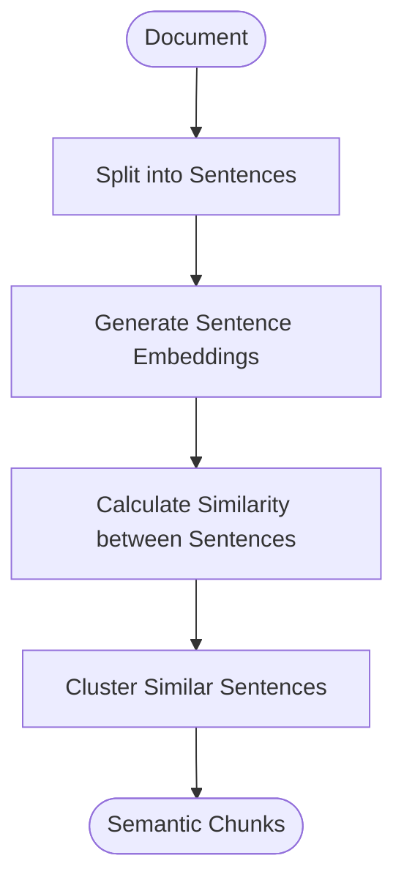

# Semantic Chunking (Advanced)

**Best for:** Documents with mixed topics.
**Note:** Requires embeddings API calls.

## How it works

The `SemanticChunker` processes a document with mixed topics through the following steps:

1. **Embed sentences:** Converts each sentence into a vector embedding.
2. **Measure similarity:** Calculates how similar the sentences are to each other based on their embeddings.
3. **Group by meaning:** Clusters sentences into chunks based on their semantic similarity.

## Example

**Document (mixed topics):**
* ML is powerful...
* Models learn patterns...
* Pizza is delicious...
* Italian food varies...
* Deep learning uses...
* Neural networks...

**Semantic Chunks:**

* **ML Topic**
  * ML is powerful...
  * Models learn patterns...
  * Deep learning uses...
  * Neural networks...
* **Food Topic**
  * Pizza is delicious...
  * Italian food varies...
