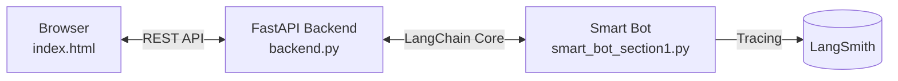

# Smart Q&A Bot Project

This folder contains a production-ready question-answering bot utilizing LangChain and FastAPI.

## Files
- **`smart_bot_section1.py`**: The core bot logic, including Pydantic structured outputs, error handling, and LangSmith tracing.
- **`backend.py`**: A FastAPI application that serves the bot via a REST API endpoint.
- **`index.html`**: A simple frontend interface to interact with the bot.

## How to run
1. Ensure your `.env` file has the necessary API keys (OpenAI, LangSmith).
2. Run the backend: `python backend.py` or `uvicorn backend:app --reload`
3. Open `http://localhost:8000` in your browser.
